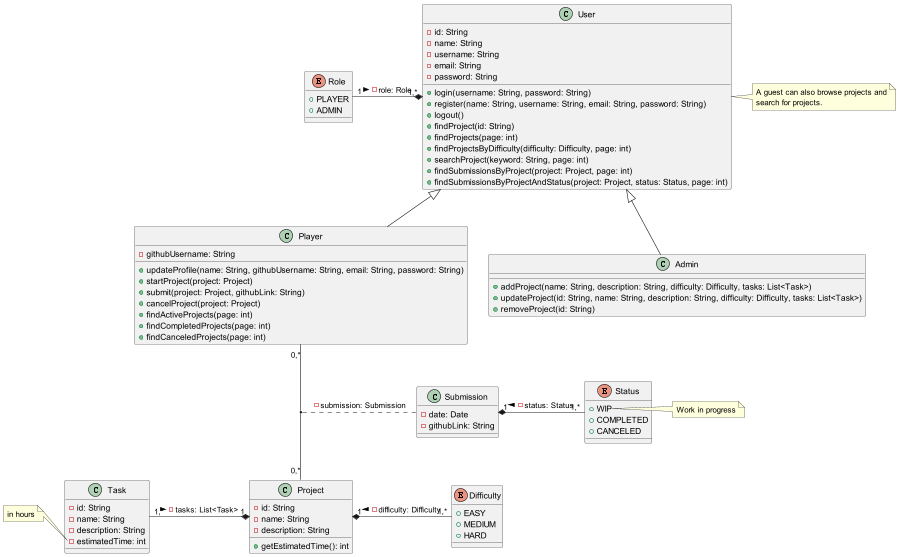

# DevQuests

## Presentation File Rouge YouCode

---

## Table of content

- [Introduction](#introduction)
- [Probléme](#probléme)
- [Solution](#solution)
  - [Class diagram](#class-diagram)
  - [Use Case Diagram](#use-case-diagram)
- [Architecture](#architecture)
- [Technologies](#technologies)
  - [Infrastructure](#infrastructure)
  - [Backend Demo](#backend-demo)
  - [Frontend Demo](#frontend-demo)

---

## Introduction

L'objectif de cette application web éducative est de fournir aux étudiants une plateforme pour apprendre et pratiquer leurs compétences en programmation. L'application comprendra une variété de projets interactifs.

---

## Probléme

L'enseignement traditionnel n'est pas efficace lorsqu'il s'agit de sujets pratiques tels que la programmation et l'informatique, c'est pourquoi nous avons besoin d'une nouvelle méthode d'apprentissage pour résoudre ce problème.

---

## Solution

DevQuests propose une plateforme d'apprentissage par la pratique et des projets de programmation sur lesquels les utilisateurs peuvent travailler et s'amuser dès qu'ils ont du temps libre. Les projets sont conçus pour être amusants et engageants et doivent être réalisés en peu de temps.

---

### Class diagram

---

---

### Use Case Diagram

---

---

## Architecture

- Microservices
- Serverless Functions
- Reactive Programming
- Functional Style
- Event-Driven Architecture
- Mono-Repository
- ...

---

## Technologies

---

### Backend Technologies

- Kotlin
- Spring Boot
- Spring Data
- Spring Security
- Spring WebFlux
- Spring Cloud Function
- ...

---

### Frontend Technologies

- Java
- Spring Boot
- Spring Web
- Spring Security
- Vaadin

---

### Infrastructure

- Docker
- Docker Compose
- Spring OCI
- MongoDB
- MongoExpress
- ...

---

### Backend Demo

---

### Frontend Demo

---

## Merci ヾ(⌐■_■)ノ♪
